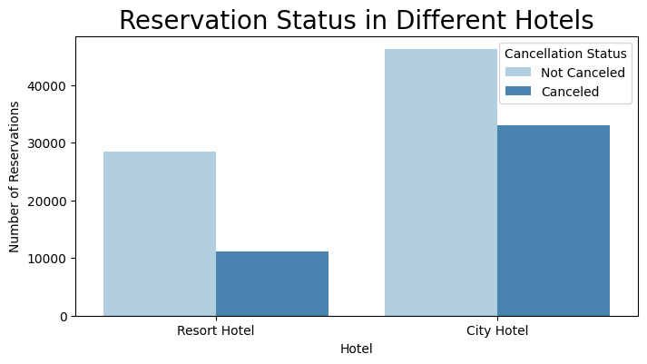
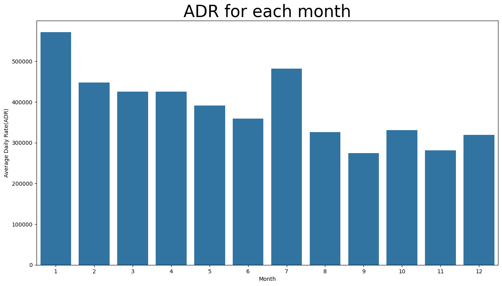

# 🏨 Hotel Booking Analysis

## 📌 Business Problem
In recent years, City Hotel and Resort Hotel have experienced high cancellation rates. Each hotel is now dealing with issues such as reduced revenue and underutilized rooms. Reducing cancellations is a primary objective to improve revenue efficiency and provide actionable business recommendations.

This analysis focuses on hotel booking cancellations and other factors affecting annual revenue generation.

---

## 📑 Assumptions
1. No unusual occurrences between 2015 and 2017 significantly impacted the dataset.
2. The information is current enough to inform hotel planning and analysis.
3. There are no unintended negative consequences from implementing recommended strategies.
4. The hotels are not currently using any of the suggested solutions.
5. Booking cancellations are the largest factor affecting revenue.
6. Cancellations result in vacant rooms for the booked period.
7. Clients make reservations in the same year they may cancel.

---

## ❓ Research Questions
1. What variables affect hotel reservation cancellations?
2. How can hotel reservation cancellations be minimized?
3. How can hotels use this data to inform pricing and promotional decisions?

---

## 🔬 Hypotheses
1. Higher prices lead to more cancellations.
2. Longer waiting lists result in higher cancellation rates.
3. The majority of bookings come from offline travel agents.

---

## 📊 Analysis and Findings

The bar graph shows the percentage of canceled versus non-canceled reservations. Approximately 37% of clients cancel their reservations, significantly impacting hotel revenue.

City Hotel has more bookings than Resort Hotel, possibly due to pricing differences, as Resort Hotel may be more expensive.

The line graph demonstrates that on certain days, City Hotel's ADR is lower than Resort Hotel's, while on other days it is higher. Weekends and holidays often show increased rates for Resort Hotel.

The grouped bar graph identifies months with the highest and lowest reservation levels. August has the most confirmed and canceled reservations, while January sees the highest cancellation rates.

Cancellations are most frequent when prices are highest and least frequent when prices are lower, indicating that higher accommodation costs strongly correlate with cancellations.

Portugal has the highest number of canceled reservations.

Analysis shows that reservations with higher ADR are more likely to be canceled, supporting the hypothesis that higher prices increase cancellations.

### **Suggestions**
1. Hotels could adjust pricing strategies or offer discounts in locations with higher cancellation rates to reduce cancellations.
2. Resort Hotel may consider weekend or holiday discounts to decrease the ratio of cancellations.
3. In January, hotels can run targeted marketing campaigns or promotional offers to boost revenue during high-cancellation periods.
4. Enhancing service quality and facilities in regions like Portugal can help reduce cancellations and improve customer satisfaction.
